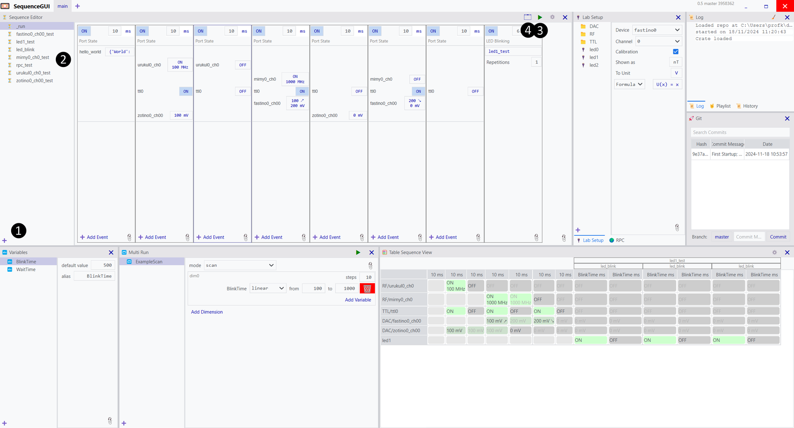
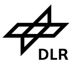

# SequenceGUI
The SequenceGUI is a laboratory software that manages and controls an ARTIQ/Sinara system. The interface lets the user assemble a sequence for a quantum experiment using very few clicks and an intuitive drag & drop system.

Based on the ARTIQ architecture provided by M-Labs (https://github.com/m-labs/artiq) and the Sinara open-source hardware.

## Installation

Installing required packages (Python = 3.10):

### SequenceGUI install:

pip install numpy scipy PySide6 qasync pyqtgraph gitpython pyqtdarktheme-fork watchdog playsound==1.2.2 git+https://github.com/m-labs/sipyco

Starting SequenceGUI:

    python main.py

The launcher will ask you for your conda directory to start the artiq_master. For that follow corresponding installation instructions (https://m-labs.hk/artiq/manual/installing.html#installing-via-conda-deprecated).
Or manually start the artiq_master with `artiq_master` in the terminal in the appropriate conda environment and directory containing the device_db.py of your setup. You can also use msys or nix (with wsl on windows) to manually run the artiq_master. However, the launcher can currently only start it automatically via conda.

After creating a project, the program will attempt to update your device_db.py to add a new entry for running RPCs. It may ask you to restart the artiq_master if it was started manually.

## How to Use

### Sequence Editor
Click here ❶ on the plus sign to create a new sequence.

At ❷ you can select sequences, with a right click you can rename or delete them.

The green play button at ❸ runs the currently selected sequence.

The button at ❹ shows the compiled ARTIQ code without running it.

### Playlist
Shows a list of all running and queued sequences. With a right click you can stop a specific sequence.

### Log
Shows a log of the program, different colors correspond to different levels of severity. The broom icon clears the log.

### Lab Setup
With a click on the plus-symbol at the bottom you can select an entry from the device_db, which you want to control in a sequence. Afterwards, you can give it a name with which you want to reference it, e.g. "Camera trigger".

### RPC
Create Python scripts that can be selected and run as RPC inside the sequence.

### Variables
Here you can define variables to replace numbers in your sequence.

### Multi Run
Here you can configure multi runs to scan a variable.

### Table Sequence View
A table view of the sequence for overview.

### Git
The current state of the project is also a git repository to simplify version control and backup of the experiment. Here you can use simple git features like commiting, branching and reversing.

## Sequences
With a right click you can create a new column that represents a time step. You can add the devices you created earlier into this time step and define what kind of properties the device should have. These properties will be set at the beginning of the time step. After the duration of the time step is over, the properties of the next time step will be set. This means that once you set a TTL to 'ON', for example, the port remains in this state until you set it to 'off' in a future time step. One exception is the Sampler module, which only samples during the time step. You must add it to every time step in which you want to record data. The data will be saved together with some other metadata (e.g. the entire sequence) into the result folder.

You can right click to delete time steps or drag and drop to reorganize them. If the enable toggle at the top of a time step is set to 'off', the entire column will be ignored during compilation and execution.

The timing of properties during one time step might not be perfectly accurate (some parameters might get shifted by a few ns), but it is deterministic.

## License
This project is licensed under GPLv3.

Copyright © 2024

German Aerospace Center (DLR), Insitute for Satellite Geodesy and Inertial Sensing, Hannover

Leibniz University Hannover (LUH), Insitute of Quantum Optics (IQO), Hannover

 

## Funding

QVLS-iLabs as part of the initiative
“Clusters4Future” is funded by the
Federal Ministry of Education and Research (BMBF)
(Grant No. 03ZU1209IB).

Part of this research was funded by the Federal
Ministry for Economic Affairs and Climate
Action (BMWK) due to an enactment of the German
Bundestag under Grant 50NA2106 (QGyro+).

